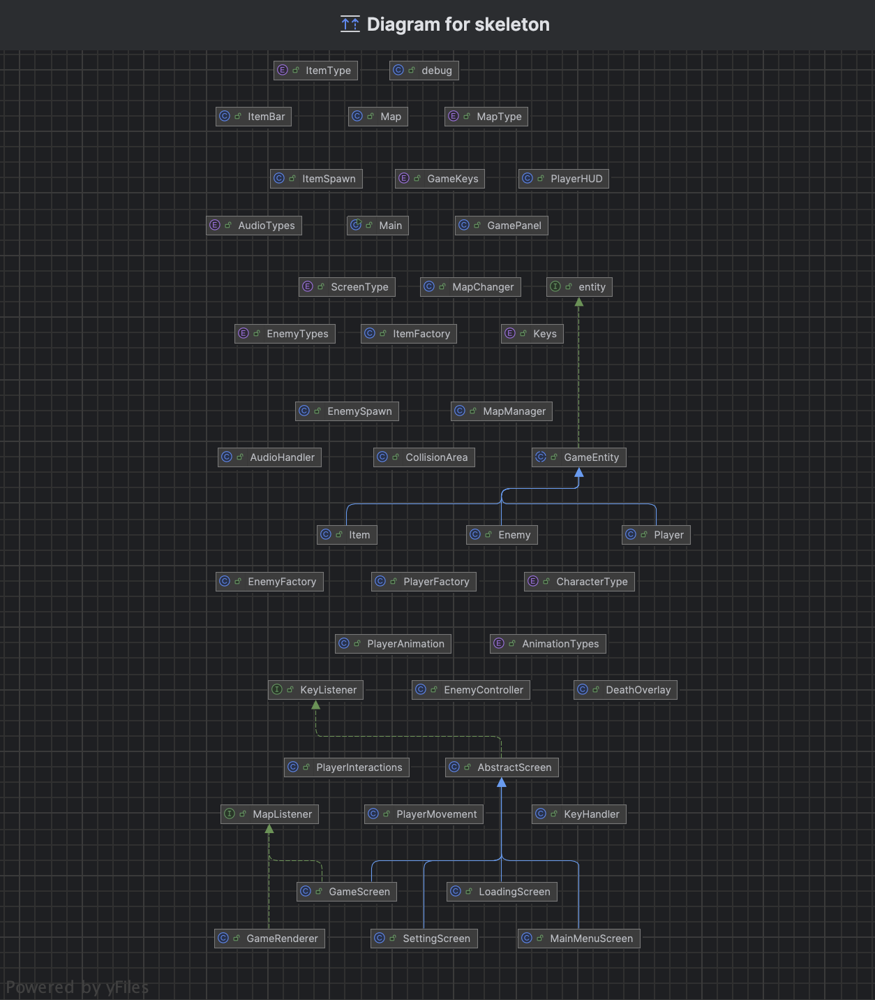

# Rapport – innlevering 4
**Team:** *IT-Krigerne* – *Martin, Emil, Vemmund, Daniel*...

()

# IT-Krigerne:

* Emil Aune Holthe / Map tester
* Martin Rønning   / Pixel-art
* Daniel Bjørnstad / Team leader
* Vemund Handeland / Custumer support

# Spillet er et 2D-fugleperspektiv action-RPG inspirert av The Legend of Zelda (1986).

*  Dette er et action adventure spill med RPG elementer der du må beseire den allmektige G. 
For å nå G må du kjempe deg gjennom fiender og hindre. Utforsk, samle gjenstander 
og finn hemmeligheter for å gjøre deg sterkere. Dør du så er du ute, og spillet må startes på nytt. 
Hvert run av spillet vil kreve at du finner våpen og annet loot slik at du kan beseire fiendene. 
Kan du klare denne utfordringen?

# Prosess og prosjektorganisering

# Vi har organisert prosjektet med:

* Parprogrammering for effektiv kodeutvikling
   Fordeler:
   - Kan hjelpe hverandre med forskjellig kunnskap.
   - Mer motiverende/morsommere å jobbe i lag med noe andre.
   - Pushe hverandre, lettere å sette krav til sidemann.

   Ulemper:
   - En i paret kan for bli passiv og ikke bidrar.
   - Hvis en i paret har mye mer kunnskap enn den andre så kan det bli vanskelig å henge med.
  
* Idémyldring for å iterere over designvalg
   - Alle sine ideer skal bli hørt.
   - Spillet skal være et resultat av kreativiteten på hele gruppen, og ikke bare noen få.
   - Finne gode løsninger på problemer som oppstår.

* Ukentlige møter (minst to ganger i uken) for oppfølging og oppdateringer
   - Pushe hverandre til å møte opp å jobbe sammen.
   - Uten fysiske ukentlige møter kan man lett bli passiv i utviklingen av spillet.
   - Hjelpe hverandre og være aktiv i samarbeid, ikke like lett over feks discoard.

* Trello for oppgavehåndtering
   - Holde et system på hva vi vil få gjort.
   - Lett å oppdatere andre hva som er gjort.

### A4: Oppsett av kodeskjelett og eksperimentering

# Vi har opprettet et grunnleggende kodeskjelett i repositoryet. Dette inkluderer:

* Mappestruktur: src/ for kildekode, assets/ for grafikk, doc/ for dokumentasjon
* Eksperimentering med rammeverk: Vi har testet ulike verktøy og biblioteker for å håndtere 2D-grafikk og spillmotor
* Foreløpig utvikling av spillkart og bevegelsessystem

Vi har fullført kravene vi satt til MVP
1. Vise et spillebrett
2. Vise spiller på spillebrett
3. Flytte spiller
4. Kan angripe
5. Kan plukke opp items
6. Spiller interagerer med terreng
7. Vise fiender/monstre; de skal interagere med terreng og spiller
8. Spiller kan dø (Miste alle "healthpoints" til en fiende)
9. Mål for spillbrett (Beseire bosser)
10. Start-skjerm ved oppstart / game over

1. 
Inventory-system:

Brukerhistorie: 
Som spiller ønsker jeg å ha en oversikt over hvilke items jeg har plukket opp, slik at jeg vet hva jeg kan bruke og når.

Akseptansekriterier: 
Når spilleren plukker opp items vises de i Inventory.
Inventory skal alltid vises enten på bunnen av skjermen eller vises ved å f.eks trykke «I».
Spilleren kan se «healing-potion», «mana-potion», sverd og rustning i inventory.
Inventory skal oppdateres korrekt ved plukk opp og bruk av items.

Arbeidsoppgaver:
Lage datastruktur for Items (gjort)
Koble når spiller plukker opp items til inventoryLage GUI som viser inventory
Legge til logikk for bruk av items (i gang)

2. 
Bossfight

Brukerhistorie: 
Som spiller ønsker jeg en utfordrende og variert bossfight, slik at det føles som en ekte finale i spillet.

Akseptansekriterier:
Bossene har flere angrepsmønster
Bossen beveger seg på et eget designet kart
Kampen blir gradvis vanskeligere
Bossen dør og utløser en klar seier når livet går til 0

Arbeidsoppgaver:
Oppdatere kartet for bossen
Designe og implementere nye angrepsmønster
Skrive logikk for hvordan bossen velger angrep
Lage "triggers" og animasjoner for bossens død

Kjente bugs:
Man kan plukke opp liv selv om man har fullt liv.
Fiender kan bli sittende fast bak gjenstander (har ikke logikk til å gå rundt)

3. 
Tydeligere mål og items

Brukerhistorie: 
Som spiller vil jeg vite hva som er målet med spillet og hva ulike items gjør, slik at jeg forstår hva jeg bør gjøre og hvorfor jeg bør plukke opp items.

Akseptansekriterier:
Spillet viser en beskjed første gang du plukker opp en nøkkel ("Denne nøkkelen gir deg tilgang til bossområdet").
Spilleren får en kort forklaring (f.eks via tooltips, tekst eller ikonforklaring) når de plukker opp items.
Det er en indikasjon (tekst, ikon, oppgave) på at målet er å finne nøkkelen for å komme til bossen.

Arbeidsoppgaver:
Lage en tutorialtekst eller dialogboks ved nøkkelpickup eller gamestart
Legge til en beskrivelsesboks når spilleren plukker opp hjerte og mana-potions
Vurdere å ha en NPC eller tavle som forklarer målet

4. 
Lage GUI for valg av karakter

Brukerhistorie: 
Som spiller ønsker jeg å kunne velge hva slags karakter jeg skal bruke før spillet begynner.

Akseptansekriterier:
Spillet viser karakteren som brukeren har valgt, og animasjoner og sprites blir satt til riktig karakter.

Arbeidsoppgaver:
Lage en meny før spillet begynner hvor brukeren kan velge karakter
Lage GUI for valg av karakter
Sette spillerkarakter ut ifra valget
Prioriteringer fremover:
Vi prioriterer funksjonalitet i spillet som gir mer dybde og variasjon i gameplay, spesielt rundt inventory og bossfight.
Flere bugs blir loggført fortløpende

Brukerhistorie: Som en spiller ønsker jeg å forstå tydelig hva som befinner seg på spillerbrettet.
Akseptansekriterie: Enkle, men detaljerte sprites.
Arbeidsoppgave: Implementere tilemap som enkelt kan endres med tydelige sprites.

Brukerhistorie: Som en spiller ønsker jeg å kunne bevege meg opp, ned, venstre og høyre.
Akseptansekriterie: Karakteren må kunne bevege seg i alle nødvendige retninger.
Arbeidsoppgave: Implementere kontroller som styrer bevegelse for karakteren og gode animasjoner.

Brukerhistorie: Spiller interagerer med terreng.
Akseptansekriterie: Spiller skal kunne bli stoppet ved å bevege seg i vegger, fiender også videre.
Arbeidsoppgave: Implementere box2d og få det til å fungere i samspill med hitboxes til sprites.

### A5: Oppsummering / retrospektiv

- Se prosjektrapport nedenfor.

# DEl B:

# Prosjektrapport/Oppsumering:

`Hva har fungert bra?`
* Parprogrammering: Vi har jobbet godt sammen to og to. Når vi jobber i par så utfyller   vi kunnskapen til hverandre og det er lettere å komme til gode løsninger.

* Dele opp arbeidsoppgaver og forklare hva vi har gjort til hverandre. 

* Vi har fått jobbet en god del og er fornøyde med det vi har klart så langt.

`Hva gikk dårlig`
* Vi laget en del tester, men mangler litt når det kommer til coverage. Vi skal bli flinkere til å lage tester både før vi jobber og mens vi jobber.

`Dette har vi fikset siden sist`
* MVC: vi har satt opp en bedre struktur i koden.
* Fiender: flere forskjellige fiender inkludert en boss.
* Animasjoner: Slå, gå og animasjoner for fiender.
* Items: Fått et system for items, inkludert potions og keys.
* UI: Helthbar, mana bar, deathscreen….
* Map: Fikset rendering av mappet, oppdatert hvordan mappet ser ut og laget et boss map.
* Tester:

`Oppsumering:`
* Rollene vi har er litt for spesifikke. Vi gjør masse mer enn hva bare de rollene sier. Emil som har map-tester for eksempel gjør mye mer enn bare det, så navnet på rollen er ikke helt optimal. Det samme gjelder for pixel art-rollen. Vi har ferdigstilt MVP som vårt mål vi satte oss sist, og forbedret spillet en god del videre. Vi har fått en god struktur i koden og implementert MVC. 

`Forbedringer til neste sprint:`
* Ferdigstille MVP
* Spillet skal være gjennomførbart og skal kunne spilles som et spill. Det skal ha et sluttmål med utfordringer underveis. Få inn animasjoner, fiender og måter å angripe på. Dette skal være en god base som vi skal kunne viderebygge på. (En bedre versjon av MVP)
* Flinkere til å notere underveis, altså møte-referat, trello og skrive ned nye mål.

`Klassediagram:`

`Trello:`
https://trello.com/invite/b/67ac74696ca3c27aff52a1d7/ATTI467b528223728134f82517d0d72f93b690C1C875/inf112-it-krigerne

[Møtereferat](møtereferat.md)

